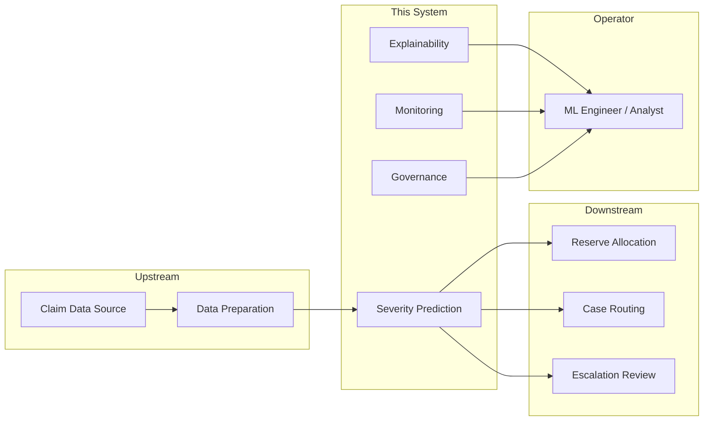
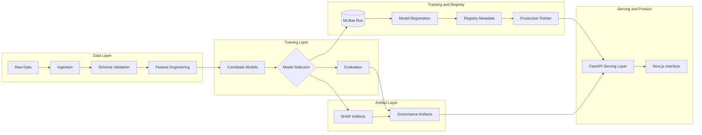
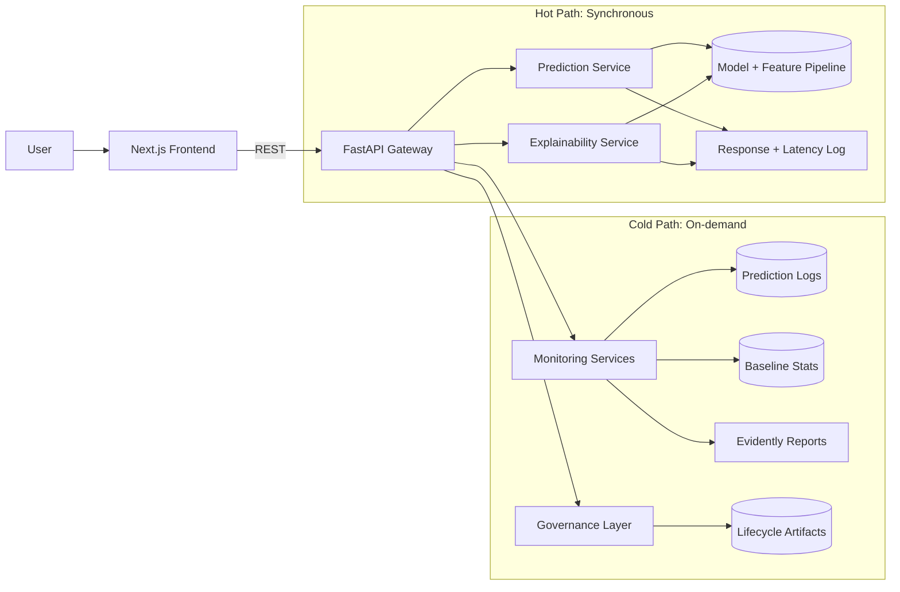
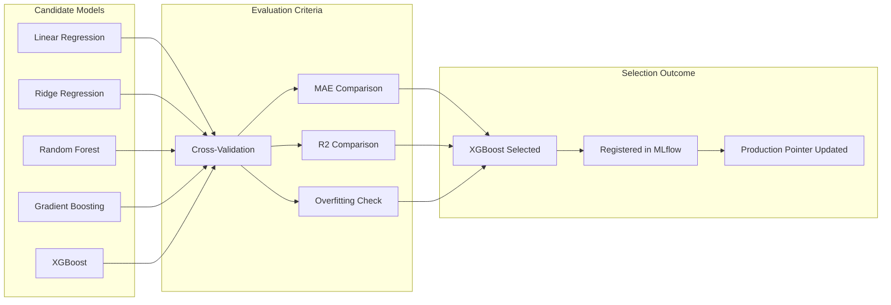
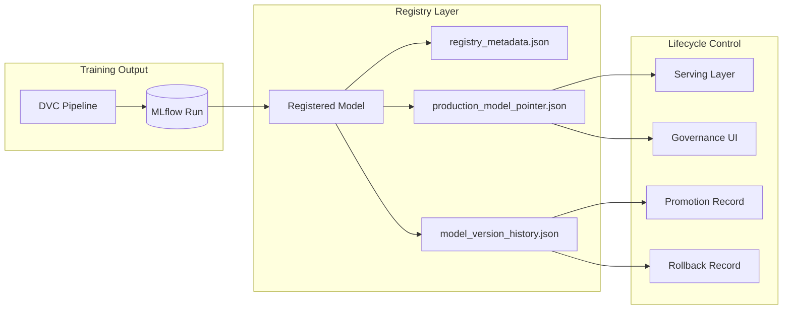
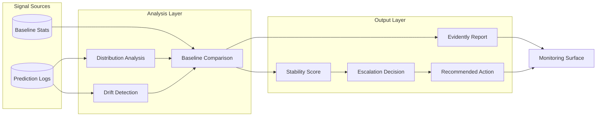
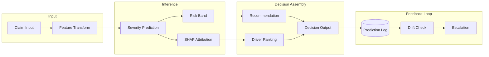
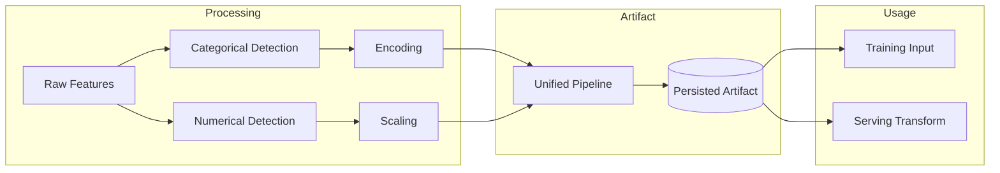
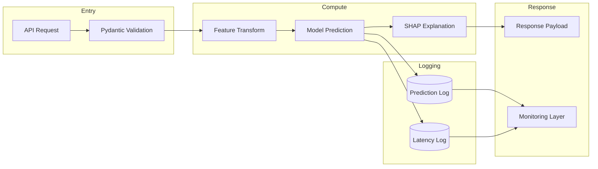
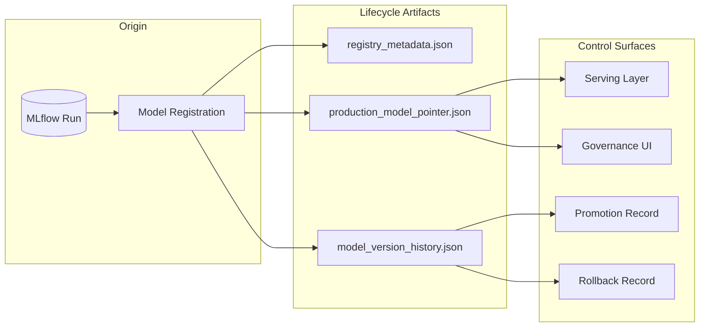

# Explainable Insurance Claim Severity System


A production-style machine learning platform for **insurance claim severity prediction** with integrated **explainability, drift monitoring, model lifecycle control, and governance visibility**.

---

## Live Demo

| Surface | Link |
|---|---|
| Frontend (Vercel) | https://insurance-claim-severity-xai-system.vercel.app/ |
| Backend API (Render) | https://insurance-claim-severity-xai-system.onrender.com |
| API Docs (Swagger) | https://insurance-claim-severity-xai-system.onrender.com/docs |

> Recommended flow: **Overview → Scoring → Simulation → Explainability → Monitoring → Governance**

> Note: The backend is hosted on Render's free tier. Initial requests may take 30–60 seconds while the service cold-starts.

---

## System Summary

Insurance claim severity estimation affects reserve planning, case triage, and escalation decisions. Predictive accuracy alone is insufficient. A usable system must surface decision context, monitor production behavior, and maintain controlled model versioning with full lineage visibility.

This platform delivers that. It integrates severity prediction, SHAP-based runtime attribution, Evidently-backed drift monitoring, MLflow experiment lineage, a custom registry and production pointer layer, and a full-stack product interface across scoring, explainability, monitoring, and governance.

It operates as a severity estimation and control layer within an insurance claim processing workflow.

---

## Quantitative Snapshot

| Category | Detail |
|---|---|
| Dataset | Allstate Claim Severity |
| Training rows | 188,318 |
| Feature columns | 132 |
| Selected model | XGBoost |
| Candidate models evaluated | Linear Regression, Ridge, Random Forest, Gradient Boosting, XGBoost |
| MAE | 1,190.07 |
| RMSE | 1,864.94 |
| R² | 0.5738 |
| Runtime instrumentation | Prediction latency logged per request |
| Explainability instrumentation | Explanation latency logged per request |
| Monitoring coverage | Distribution analysis, drift detection, baseline comparison, Evidently reports |
| Lifecycle control | Registry metadata, production pointer, promotion and rollback traceability |

---

## Technology Stack

| Layer | Technologies |
|---|---|
| Pipeline orchestration | DVC |
| Experiment tracking and registry | MLflow |
| Data and modeling | Python, pandas, NumPy, scikit-learn, XGBoost |
| Explainability | SHAP, LIME |
| Monitoring and observability | Evidently, custom monitoring services |
| Backend | FastAPI, Pydantic, Uvicorn |
| Frontend | Next.js, TypeScript, Recharts |
| Deployment | Docker, Render, Vercel |
| Governance artifacts | JSON-based lifecycle and governance metadata |

---

## Business Problem

Insurance claim severity directly influences reserve estimation, case prioritization, and escalation routing. In production, a severity model fails operationally regardless of held-out metrics if:

- individual predictions cannot be interpreted at runtime
- dominant cost drivers cannot be surfaced per claim
- distribution shift goes undetected after deployment
- the active model version has no audit-accessible lineage
- governance artifacts exist only as offline documentation

This system was built to close that operational gap.

---

## System Objective

The platform operationalizes four capabilities as first-class system functions:

**Decision support:** severity prediction with risk band classification, operational recommendation, and counterfactual scenario analysis.

**Explainability:** local SHAP attribution at runtime, with before-vs-after driver comparison under simulated input change.

**Observability:** distribution tracking, drift detection, stability scoring, and Evidently report generation converted into operator-facing escalation guidance.

**Lifecycle governance:** MLflow experiment lineage extended with a custom production pointer, version history, and rollback traceability, accessible through the governance surface.

---

## System Value

| Capability | What changes operationally |
|---|---|
| SHAP runtime explainability | Each prediction carries an auditable driver breakdown |
| Counterfactual simulation | Scenario sensitivity is testable without retraining |
| Evidently report generation | Behavioral drift is captured in structured, auditable reports |
| Custom monitoring layer | Raw signals are converted into escalation decisions and recommended actions |
| Production pointer + version history | Active model identity is traceable and rollback-ready at any point |
| Governance surface | Lifecycle state is reviewable without direct MLflow access |

---

## Role in Workflow

Within a claim processing pipeline, this system operates at the point where structured claim data becomes an estimated severity signal.

It sits between:

- data intake and feature preparation upstream
- downstream processes such as reserve allocation, case routing, and escalation review

The output of the system is not only a severity estimate, but a structured decision object containing:

- predicted severity
- risk classification
- driver attribution
- monitoring traceability

This allows the severity signal to be consumed by downstream systems with context and auditability.

### System Context



The system context diagram shows the platform's position in the broader workflow. Structured claim data enters from upstream preparation. The platform produces severity estimates consumed directly by downstream allocation, routing, and escalation processes. Operators interact with the system through the explainability, monitoring, and governance surfaces. The platform does not control upstream ingestion or downstream financial decisions; it provides the structured signal and operational visibility that enables those systems to act.

---

## Architecture

### End-to-End Lifecycle



The lifecycle moves left to right across five isolated stages. The **Data Layer** ingests, validates schema contracts, and engineers features. The **Training Layer** trains multiple candidate models, selects the best by MAE and R², and evaluates it against a held-out set. The **Tracking and Registry** stage captures the full run in MLflow and resolves it to a production pointer: the single file that determines which model artifact the serving layer loads. The **Artifact Layer** runs in parallel, generating SHAP outputs and governance documents from the same selected model. The **Serving and Product** layer exposes everything through FastAPI and Next.js. The production pointer is the hard control boundary between training and serving; no serving component reads from MLflow at runtime.

---

### Runtime Architecture: Hot Path vs. Cold Path

The runtime path is explicitly separated into latency-sensitive (hot path) and analytical (cold path) operations.



The backend separates concerns into two explicit paths. The **hot path** handles synchronous, latency-sensitive operations: prediction and explanation requests hit the persisted model and feature pipeline artifact and return immediately with a response payload plus latency log. The **cold path** handles on-demand and async operations: monitoring services aggregate from prediction logs and baseline stats to produce Evidently reports and operator decisions; the governance layer reads from file-based lifecycle artifacts with no runtime dependency on MLflow. This separation means monitoring load never interferes with prediction latency.

---

### Model Selection



Five candidate models are trained under identical cross-validation conditions. XGBoost was selected on the basis of lowest MAE (1,190.07), highest R² (0.5738), and stable generalization across folds with no evidence of overfitting. The selection outcome is registered in MLflow and the production pointer is updated atomically. All other candidate run metrics are retained in MLflow for future comparison or rollback.

---

### MLflow Lifecycle Control



DVC pipeline outputs trigger an MLflow run that captures full parameter, metric, and artifact lineage. Registration context is written into the MLflow model registry and simultaneously materialized into three file-based artifacts. The production pointer is the single source of truth for which model is live; it is what the serving layer reads on startup. Promotion and rollback events are appended to the version history log, making the full lifecycle auditable without requiring MLflow UI access at runtime.

---

### Monitoring Pipeline



Prediction logs and baseline statistics feed two parallel analysis paths: distribution analysis and drift detection. Both converge at the baseline comparison node, which is where behavioral shift is quantified. From that comparison, two output streams are produced. Evidently generates a structured HTML report that formalizes the state as an auditable artifact. The custom layer produces a stability score, translates it into an escalation decision, and surfaces a recommended action. Both streams converge on the monitoring surface, giving the operator report-grade evidence and an operational decision in the same view.

---

### Decision Flow



A claim input is transformed by the persisted feature pipeline before reaching the model. The severity prediction immediately branches into two parallel enrichment paths: risk band classification frames the output operationally, and SHAP attribution identifies which features drove the score. Both paths converge into a single decision output containing the severity estimate, risk label, recommendation, and ranked driver list. That output is logged and feeds back into the monitoring layer, where it contributes to drift checks and downstream escalation decisions. Every scoring event is simultaneously a monitoring event.

---

### Feature Pipeline



Raw features are split at detection time into categorical and numerical branches, each processed independently. Both branches are combined into a single unified pipeline object and serialized as an artifact. The same artifact is loaded at training time to produce model inputs and at serving time to transform live claim features. Using one shared artifact for both paths eliminates training-serving skew at the feature level.

---

### Request Execution Flow



Each request is validated through Pydantic before any computation begins. The validated payload passes through the feature pipeline and into the model. Three operations then execute in parallel from the prediction: SHAP attribution is computed and assembled into the response payload, the prediction is written to the log store, and latency is recorded. Both the prediction log and the latency record feed the monitoring layer. Every request is therefore a scoring event and a monitoring event simultaneously.

---

### Governance Flow



Each MLflow run that results in registration writes its outcome into registry metadata and updates the production pointer. The pointer controls which model artifact the serving layer loads. Every change to the pointer, whether a promotion or a rollback, is appended as a timestamped record to the version history. The governance UI reads from these file-based artifacts directly, exposing current model identity, stage, and full change history without requiring live MLflow access.

---

## Model Selection Summary

Five candidate models were trained under identical conditions and evaluated on MAE, RMSE, and R². XGBoost was selected on three criteria: lowest absolute error (MAE 1,190.07), strongest variance explanation (R² 0.5738), and stable performance across cross-validation folds with no overfitting signal.

| Model | MAE | RMSE | R² | Selected |
|---|---|---|---|---|
| Linear Regression | baseline | baseline | baseline | No |
| Ridge Regression | marginally better | similar | similar | No |
| Random Forest | improved | improved | improved | No |
| Gradient Boosting | competitive | competitive | competitive | No |
| XGBoost | 1,190.07 | 1,864.94 | 0.5738 | Yes |

All candidate runs are retained in MLflow. The production pointer references the registered XGBoost artifact. Any historical candidate can be promoted via the version history layer without retraining.

---

## Core Components

### Data Pipeline: DVC

Training is orchestrated through DVC as an explicit, dependency-tracked pipeline across six stages: ingestion, schema validation, feature engineering, training, evaluation, and explainability artifact generation. Each stage is independently cacheable. Changing one stage only reruns downstream stages, not the full pipeline.

### Data Validation

Schema validation runs at ingestion time against a defined feature contract. The feature manifest records expected column types, value ranges, and categorical cardinality. Validation failures surface before training begins, not at serving time.

### Feature Layer

A feature manifest and preprocessing pipeline are persisted at training time and loaded at serving time. Both the training input and the live serving transform use the same artifact. This eliminates training-serving skew at the feature level.

### Experiment Tracking and Registry: MLflow

MLflow is the experiment lineage and registry backbone. It tracks run parameters, metrics, model artifacts, and registration context across all candidate training runs.

The platform extends MLflow with three explicit lifecycle control artifacts:

| Artifact | Purpose |
|---|---|
| `registry_metadata.json` | Active model attributes and registration state |
| `production_model_pointer.json` | Serving-linked version reference |
| `model_version_history.json` | Chronological promotion and rollback log |

Without MLflow, the system loses experiment history. Without the custom pointer and version layer, it loses active lifecycle control. Both are structurally required.

### Explainability Layer: SHAP

SHAP TreeExplainer is exposed as a dedicated runtime service, not a training artifact. It supports live attribution requests, positive and negative driver separation, and before-vs-after attribution comparison under simulated scenario change. SHAP is computed per-request, meaning every prediction can be individually explained without batch post-processing.

### Monitoring and Observability: Evidently + Custom Layer

**Evidently (reporting layer):** generates structured HTML reports from prediction logs and baseline statistics. Formalizes data and behavior comparison into auditable, reviewable artifacts.

**Custom monitoring layer (decision layer):** converts raw signals into operator-facing decisions.

| Raw Signal | Operator Output |
|---|---|
| Distribution summaries | Stability score |
| Drift detection | Drift severity framing |
| Baseline comparison | Escalation decision |
| Trend analysis | Recommended action |

The two layers are complementary. Evidently handles structured reporting. The custom layer handles operational interpretation. Neither replaces the other.

### Governance Layer

Governance artifacts including model card, version metadata, responsible AI framing, and promotion and rollback history are runtime-accessible through the governance surface. They are linked to the serving layer via the production pointer, not maintained as offline documentation.

### Serving Layer: FastAPI

FastAPI backend with independent route groups for health, model metadata, prediction, explainability, monitoring, and governance. Hot-path routes (predict, explain) and cold-path routes (monitoring, governance) are separated in implementation to ensure monitoring load does not affect prediction latency.

### Product Interface: Next.js

Next.js frontend decoupled from serving infrastructure. Operates against REST endpoints across five product surfaces. Independently deployed on Vercel.

---

## Product Surfaces

### Overview
Platform entry. Backend readiness check, active model metadata visibility, predefined scenario launch, downstream surface routing.

### Scoring
Severity prediction with risk band classification, operational recommendation, and counterfactual scenario comparison. Dominant-driver sensitivity testing is available within the same flow.

### Explainability
Live SHAP attribution with feature contribution ranking, positive and negative driver separation, and baseline vs. simulated comparison. Attribution delta analysis identifies which features moved and by how much under scenario change.

### Monitoring
Distribution tracking, drift visibility, stability score, skew and volatility interpretation, escalation recommendation, and action prioritization. Converts behavioral signals into structured operator guidance.

### Governance
Active model record, stage visibility, version history, audit framing, rollback readiness indicator, and responsible AI review signals. Exposes lifecycle state without requiring direct MLflow access.

---

## API Surface

| Endpoint | Purpose |
|---|---|
| `/health` | Backend readiness and service availability |
| `/model-info` | Active model metadata and lifecycle visibility |
| `/predict` | Live claim severity prediction |
| `/explain` | SHAP-based prediction explanation |
| `/monitoring/summary` | High-level monitoring summary |
| `/monitoring/drift` | Lightweight drift checks |
| `/monitoring/distribution` | Prediction distribution analysis |
| `/monitoring/evidently` | Evidently report generation |

### Frontend to Backend Mapping

| Surface | Endpoint(s) | Path type |
|---|---|---|
| Overview | `/health`, `/model-info` | Cold path |
| Scoring | `/predict` | Hot path |
| Explainability | `/explain` | Hot path |
| Monitoring | `/monitoring/*` | Cold path |
| Governance | `/model-info` | Cold path |

---

## Operational Flow

**Step 1: Overview**
Verify backend readiness, review active model metadata, and launch a predefined claim scenario.

**Step 2: Scoring**
Submit a live claim. Inspect severity estimate, risk band, and operational recommendation.

**Step 3: Counterfactual simulation**
Modify input parameters and compare how the estimate and driver attribution shift.

**Step 4: Explainability**
Inspect SHAP attribution for baseline and simulated scenarios. Identify which features caused the change.

**Step 5: Monitoring**
Review prediction distribution, drift severity, stability score, and escalation recommendation.

**Step 6: Governance**
Review active model identity, stage, version history, and responsible AI framing.

---

## Runtime Performance

| Instrumentation | Detail |
|---|---|
| Prediction latency | Logged per request at the serving layer |
| Explanation latency | Logged per SHAP request independently |
| Request traceability | Per-request logging supports downstream monitoring aggregation |
| Monitoring aggregation | Prediction and explanation logs feed distribution and drift checks |

Latency instrumentation is structural. It feeds the monitoring layer directly rather than existing as isolated observability.

---

## Known System Constraints

| Constraint | Detail |
|---|---|
| Cold start | Backend hosted on Render free tier. First request after inactivity takes 30-60 seconds |
| SHAP computation | TreeExplainer adds latency proportional to feature count. At 132 features, p95 explanation latency is measurable but acceptable for the current load profile |
| Monitoring baseline | Initialized from training-time summary statistics. Baseline does not update automatically as production distribution shifts |
| Governance workflows | Model promotion and rollback are metadata operations. No executable approval gate is wired; governance controls are operator-facing review surfaces |
| Fairness controls | Subgroup and fairness analysis are not yet active runtime controls |

These are documented constraints, not undiscovered gaps.

---

## Key Design Tradeoffs

**Custom production pointer vs. MLflow native stage labels**
MLflow's built-in staging (Staging, Production, Archived) requires MLflow runtime access to resolve at serving time. A file-based pointer decouples serving from MLflow availability and makes the active model reference readable by any component, including the governance UI, without a live MLflow connection. The tradeoff is that the pointer layer must be maintained consistently alongside MLflow state.

**Per-request SHAP vs. batch explanation**
Computing SHAP per-request adds latency but enables counterfactual comparison, scenario sensitivity testing, and attribution-delta analysis at runtime. A batch approach would reduce serving cost but would eliminate the interactive explainability surface entirely. The current architecture accepts the latency cost in exchange for full runtime interpretability.

**Evidently reports vs. custom monitoring alone**
Custom monitoring alone could produce all operational signals. Evidently was added because it generates structured, shareable HTML artifacts that can serve as audit evidence independent of the platform's own UI. The cost is an additional dependency; the benefit is report-grade output that is readable outside the system.

**Stateless serving layer**
The FastAPI serving layer holds no state. Model and feature pipeline are loaded from disk on startup. This simplifies deployment and horizontal scaling but means cold-start time includes artifact loading. For the current single-instance deployment on Render, this is acceptable.

---

## Monitoring and Observability

The monitoring stack operates in two layers with distinct responsibilities.

**Evidently (reporting layer):** generates structured HTML reports from prediction logs and baseline statistics. Formalizes data and behavior comparison into auditable, reviewable artifacts.

**Custom monitoring services (decision layer):** operates on the same signals to produce operator-facing outputs including stability score, drift severity framing, escalation decision, and recommended action. Converts monitoring state into actionable guidance.

Neither layer replaces the other. Evidently handles report-grade observability. The custom layer handles operational response.

Monitoring outputs are derived from the same prediction events that serve user requests, ensuring no divergence between observed and reported behavior.

---

## MLflow and Lifecycle Control

MLflow functions as the experiment tracking and registry backbone across the full training lifecycle, covering run parameter and metric lineage, model artifact logging, and registration context for model versioning.

The platform extends MLflow with a custom lifecycle control layer:

- `production_model_pointer.json`: file-based active model reference used by the serving layer and governance surface
- `registry_metadata.json`: model attributes and registration state readable without MLflow UI access
- `model_version_history.json`: chronological promotion and rollback log

This separation ensures that experiment lineage (MLflow) and active serving control (custom layer) are independently accessible. The serving layer does not depend on MLflow runtime state.

---

## Architectural Rationale

| Layer | Responsibility | Isolation rationale |
|---|---|---|
| DVC pipeline | Training reproducibility | Stage-level dependency control independent of serving |
| MLflow + custom registry | Experiment lineage and version control | Serving layer reads file artifacts, not MLflow runtime |
| FastAPI serving | Prediction, explainability, monitoring APIs | Stateless serving decoupled from training infrastructure |
| Custom monitoring | Operational signal interpretation | Separates reporting (Evidently) from decision logic |
| Next.js frontend | Product interface | Independently deployable, REST-only coupling to backend |
| Governance layer | Lifecycle review surface | Readable without direct MLflow or serving layer access |

Each layer can be updated, redeployed, or replaced independently. Coupling is limited to defined artifact contracts and REST interfaces.

---

## System Boundary

The platform is designed as a self-contained severity estimation layer.

It does not:

- handle raw data ingestion from external systems
- execute downstream financial decisions or reserve allocation
- enforce governance approvals as executable workflows

Instead, it provides the structured outputs, monitoring signals, and lifecycle visibility required for those systems to operate with informed inputs.

---

## Engineering Decisions

**DVC:** explicit, dependency-tracked pipeline stages enforce reproducibility and eliminate notebook-level lineage gaps. Changing a single stage reruns only downstream dependencies.

**MLflow:** experiment lineage, parameter history, metric records, and registration context. Used as the control plane backbone, not a passive logging utility.

**Custom production pointer:** file-based active model reference for serving and governance. Removes coupling to MLflow UI state or internal stage labels. Readable by any system component without a live MLflow connection.

**SHAP as a runtime service:** explainability is a live API capability, not a post-training artifact. Supports per-request attribution and scenario comparison at inference time. Enables counterfactual analysis without retraining.

**Evidently + custom monitoring:** Evidently produces structured, auditable reports. The custom layer converts those outputs into stability scores, escalation decisions, and recommended actions. Both are required.

**Separate Next.js frontend:** decoupled from serving infrastructure, independently deployed, REST-only interface to backend services.

**Docker:** full environment encapsulation for the backend stack. Consistent runtime behavior across local and deployed environments.

---

## Design Principles

| Principle | Implementation |
|---|---|
| Reproducibility | Training pipeline is stage-driven and dependency-tracked via DVC |
| Interpretability | Every prediction is explainable at runtime via SHAP |
| Observability | Model behavior is continuously measurable through distribution, drift, and stability checks |
| Control | Model lifecycle is explicitly managed through versioning, registry metadata, and pointer-based serving |

---

## System Scope and Assumptions

### In scope
- Full DVC-orchestrated training lifecycle with six explicit pipeline stages
- MLflow tracking, registration, and extended lifecycle metadata
- Live prediction and explanation APIs
- Observability surfaces combining Evidently and custom monitoring
- Governance artifacts and responsible AI framing
- Full-stack deployment via Docker, Render, and Vercel

### Current assumptions
- Baseline monitoring is initialized from training-time summary statistics
- Fairness and subgroup analysis are not yet active runtime controls
- Some governance controls are operator-facing review surfaces rather than executable approval workflows
- SHAP feature naming can be further aligned to business-native terminology

---

## Repository Structure

```
src/
  api/                        # FastAPI route groups (predict, explain, monitoring, governance)
  data/                       # Ingestion and validation logic
  features/                   # Feature engineering and manifest
  models/                     # Training, selection, and evaluation
  explainability/             # SHAP runtime service
  monitoring/                 # Custom monitoring + Evidently integration
  governance/                 # Governance artifact generation

artifacts/
  baseline_stats.json         # Training-time distribution baseline for monitoring
  feature_manifest.json       # Feature contract used for validation and serving
  governance/                 # Model card and responsible AI artifacts

data/
  raw/                        # Source data (Allstate Claim Severity)
  processed/                  # Cleaned and validated data
  features/                   # Engineered feature sets
  validation_reports/         # Schema validation outputs

models/
  best_model.pkl              # Selected XGBoost model artifact
  feature_pipeline.pkl        # Persisted preprocessing pipeline (shared by training and serving)

reports/
  evaluation/                 # Model evaluation outputs across all candidates
  shap/                       # SHAP summary and feature importance artifacts
  evidently/                  # Generated monitoring reports

frontend/
  app/
    overview/                 # Platform entry and readiness surface
    scoring/                  # Live prediction and counterfactual surface
    explainability/           # SHAP attribution and comparison surface
    monitoring/               # Drift and distribution observability surface
    governance/               # Lifecycle and responsible AI review surface
```

---

## Getting Started

### Backend

```bash
# Install dependencies
pip install -r requirements.txt

# Run the FastAPI server
uvicorn src.api.main:app --reload --host 0.0.0.0 --port 8000
```

### Frontend

```bash
cd frontend

# Install dependencies
npm install

# Run the Next.js development server
npm run dev
```

### Docker

```bash
# Build the backend container
docker build -t claim-severity-api .

# Run the container
docker run -p 8000:8000 claim-severity-api
```

### DVC Pipeline

```bash
# Reproduce the full training pipeline
dvc repro

# Pull tracked artifacts without rerunning pipeline
dvc pull
```

---

## Deployment

| Component | Platform | Method |
|---|---|---|
| Backend | Render | Dockerized FastAPI deployed as a web service |
| Frontend | Vercel | Next.js deployed via Vercel CLI or GitHub integration |
| API communication | REST | Frontend reads backend URL from environment variable |

Environment variable required:

- `NEXT_PUBLIC_API_URL`: backend base URL configured in the frontend environment

---

## License

This project is licensed under the Apache License 2.0.

You are free to use, modify, and distribute this code with proper attribution and compliance with the license terms.

See the [LICENSE](LICENSE) file for full details.

---

## Author

**Ijaz Kakkod**

Machine Learning Systems | Explainable AI | Model Governance

Focused on building production-grade ML systems with emphasis on interpretability, observability, lifecycle control, and decision-oriented AI platforms.

[](https://github.com/IjazKakkodDS)
[](https://www.linkedin.com/in/ijazkakkod/)
